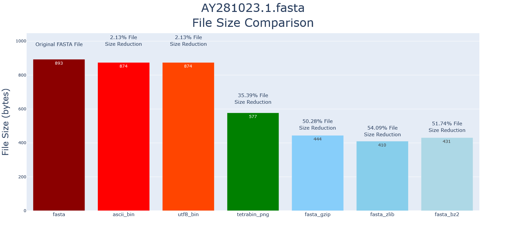
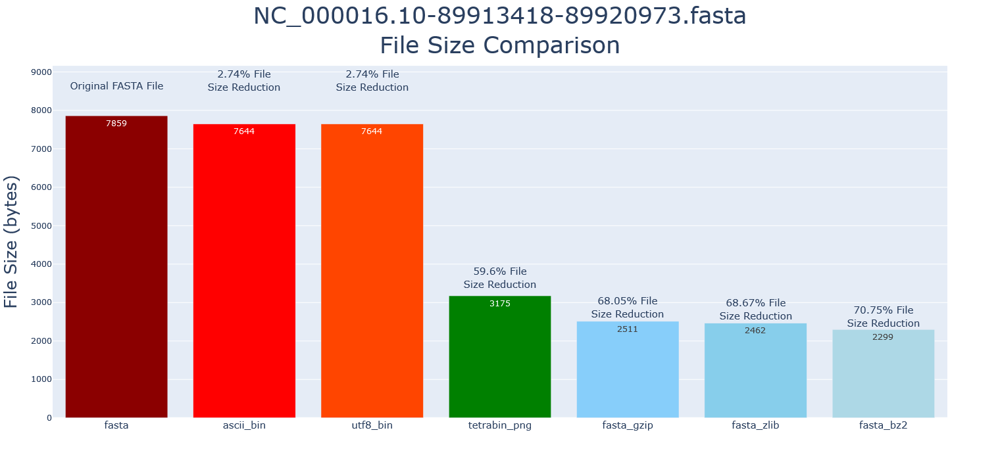
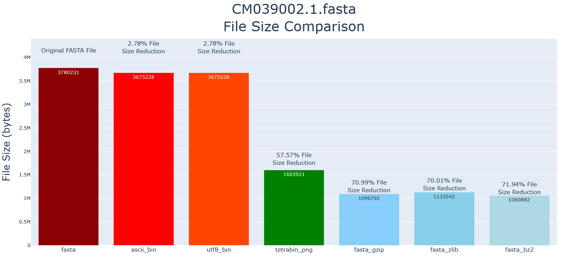

# TetraBin-Nucleotide-Encoding
A method for encoding data from FASTA files (or other Nucleotide raw data) into a more size efficient file

FASTA FILE ENCODING - ASCII:
In ASCII encoding, each character is represented by a single byte, which is a sequence of 8 bits. Since there are only 128 characters in the ASCII character set, each character can be represented by a unique combination of 7 bits (2^7 = 128).

For example, the ASCII encoding of the letter "A" is the binary sequence 01000001. This corresponds to the decimal value 65, which is the ASCII code for the letter "A". Similarly, the ASCII encoding of the letter "B" is the binary sequence 01000010, which corresponds to the decimal value 66.

Since each character is represented by a single byte in ASCII encoding, the size of an ASCII-encoded file is directly proportional to the number of characters in the file. For example, a text file containing 1000 ASCII characters will have a file size of 1000 bytes.

BINARY TETRAD ENCODING:
| ASCII Binary (8-bit) | Binary Tetrad (4-bit) | Representative Character | Description |
|----------------------|-----------------------|--------------------------|-------------|
| 01011111 | 0000 | - | Dash
| 00100000 | 0000 |   | Blank
| 01010100 | 0001 | T | Thymine
| 01010101 | 0001 | U | Uracil
| 01000001 | 0010 | A | Adenosine
| 01000011 | 0100 | C | Cytosine
| 01000111 | 1000 | G | Guanine
| 01010111 | 0011 | W | A/T
| 01010011 | 1100 | S | C/G
| 01001101 | 0110 | M | A/C
| 01001011 | 1001 | K | G/T
| 01010010 | 1010 | R | A/G
| 01011001 | 0101 | Y | C/T
| 01000010 | 1101 | B | Not A
| 01000100 | 1011 | D | Not C
| 01001000 | 0111 | H | Not G
| 01010110 | 1100 | V | Not T
| 01001110 | 1111 | N | Any

Sequence of "TACG" would normally get encoded in ASCII as "01010100010000010100001101000111" (32 bits)

With the proposed Binary Tetrad encoding the same sequence would be "0001001001001000" (16 bits)

Furthermore, we can then consider that each nucleotide binary tetrad consists of four values T => [0,0,0,1], which is perfectly size to be representative of pixel information (r,g,b,a). So we can then encode a single row of pixels where each value in the rgba-array holds the nucleotide information. We can then use an already small image format like PNG to reduce the file size significantly.

GRAPHICAL SIZE COMPARISONS:

Notice the file size redction is only to 2/3 the original file. This is due to the Description information taking up more data than the Sequence.

As the Sequence length increases; file size reduction can easily break 1/2 the original file size!

The longer the sequences get the closer towards compression level file sizes can be achieved.

AREAS OF EXPANSION (WIP):
    .md5 checksums

FILE DESCRIPTIONS (WIP):
    .fasta a 2 line file 1)Header, 2) Sequence
    .fastq (Illumina), .fasta with ascii codes phred32/phred64 base calling meta-quality-data with spacer lines, a 4 line file 1) Header, 2) Quality, 3) Bases, 4) Spacer Line
    .fast5 (Nanopore), .fastq with pore data There are 3 main branches of data stored in the fast
